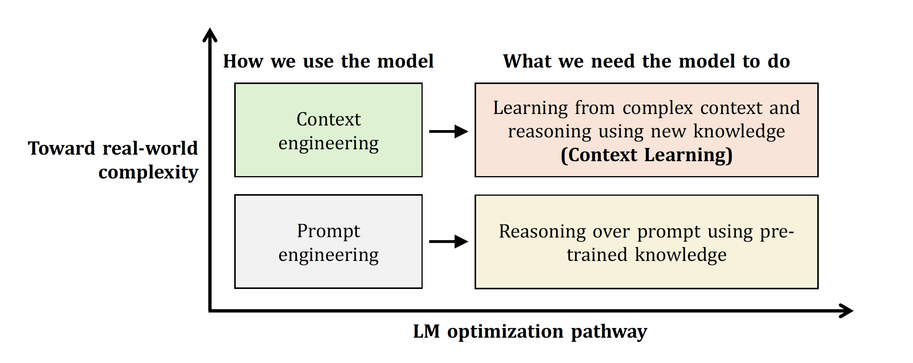
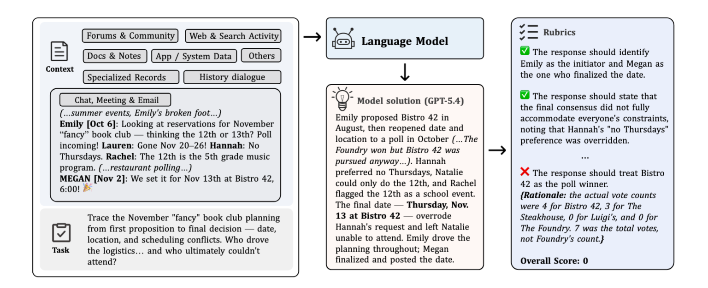

<div align="center">

</div>

# CL-bench family: A series of benchmarks for Context Learning

[](https://www.clbench.com)

## 🔥 News!!

- **2026.04**: 🎉 [CLBench-life](#clbench-life) released — 405 real-life context learning tasks (group chats, personal notes, game logs, etc.) with 5,348 rubrics. Best model solves 19.3%. [[Paper]](clbench-life-paper.pdf) [[Data]](https://huggingface.co/datasets/tencent/CLBench-life)
- **2026.02**: 🎉 [CL-bench](#cl-bench-1) released — 1,899 professional & domain-specific context learning tasks. Best model solves 23.7%. [[Paper]](https://arxiv.org/abs/2602.03587) [[Data]](https://huggingface.co/datasets/tencent/CL-bench) [[Blog]](https://hy.tencent.com/research/100025?langVersion=en)

## Contents

- [CL-bench](#cl-bench-1) — Professional & domain-specific context learning
- [CLBench-life](#clbench-life) — Real-life context learning
- [Quick Start](#-quick-start)
- [Submit Results](#-submit-results)
- [Citation](#-citation)
- [Contact](#-contact)

---

## CL-bench

[](https://arxiv.org/abs/2602.03587)
[](https://huggingface.co/datasets/tencent/CL-bench)
[](https://hy.tencent.com/research/100025?langVersion=en)
[](https://www.clbench.com)

CL-bench evaluates whether language models can learn new knowledge from context at inference time. Tasks require models to learn from domain-specific knowledge, rule systems, complex procedures, and empirical laws — all absent from pre-training.

<p align="center">
  
</p>

*Mismatch between how language models are commonly optimized in practice and the capabilities required by real-world tasks.*

<p align="center">
  
</p>

*Each instance in CL-bench comprises a system prompt, a task, the context containing new knowledge necessary for solving the task, and rubrics to assess the solution. All instances are annotated by experienced domain experts.*

**Stats**: 1,899 tasks · 4 categories · 18 sub-categories · avg. 63.2 rubrics per context · avg. 20 hours expert effort per context

**Context Categories**:
- **Domain Knowledge Reasoning** — specialized domain knowledge requiring understanding and application
- **Rule System Application** — formal rule systems that must be learned and correctly applied
- **Procedural Task Execution** — complex multi-step procedures to follow
- **Empirical Discovery & Simulation** — patterns and laws derived from empirical data

---

## CLBench-life

[](clbench-life-paper.pdf)
[](https://huggingface.co/datasets/tencent/CLBench-life)
[](https://www.clbench.com)

CLBench-life extends context learning evaluation to real-life scenarios. Contexts are messy, fragmented, and grounded in everyday experience — the kind of data people actually deal with daily. Even the best model (GPT-5.4) solves only 19.3%, with an average of 13% across 10 frontier models.


<p align="center">
  
</p>


**Stats**: 405 context-task pairs · 5,348 rubrics (avg. 10.7 per task) · 3 categories · 9 sub-categories

**Context Categories**:
- **Communication & Social Interactions** — group chats, meeting transcripts, private conversations, community threads
- **Fragmented Information & Revisions** — personal notes, news feeds, document edit histories, version logs
- **Behavioral Records & Activity Trails** — game logs, browsing histories, transactions, fitness/health tracking

---

## 🚀 Quick Start

Both benchmarks share the same evaluation pipeline — just point to different input files.

```bash
pip install openai tqdm
```

Download datasets from HuggingFace:
- [tencent/CL-bench](https://huggingface.co/datasets/tencent/CL-bench) → `CL-bench.jsonl`
- [tencent/CLBench-life](https://huggingface.co/datasets/tencent/CLBench-life) → `CLBench-life.jsonl`

### Inference

```bash
export OPENAI_API_KEY="your_api_key"

# CL-bench
python infer.py --model <model_name> --input CL-bench.jsonl --workers 20

# CLBench-life
python infer.py --model <model_name> --input CLBench-life.jsonl --workers 20

# For non-OpenAI models, specify base URL and API key
python infer.py --model <model_name> \
    --base-url <api_base_url> \
    --api-key <api_key> \
    --input CL-bench.jsonl
```

### Evaluation

CL-bench uses GPT-5.1 (low reasoning effort) as the default judge; CLBench-life uses GPT-5.1 (high reasoning effort).

```bash
# CL-bench (low reasoning effort)
python eval.py --input outputs/<model_output>.jsonl --judge-model gpt-5.1 --reasoning-effort low

# CLBench-life (high reasoning effort)
python eval.py --input outputs/<model_output>.jsonl --judge-model gpt-5.1 --reasoning-effort high
```

Evaluation is binary: a task is solved only if the model's response passes **all** associated rubrics. For reasoning models, only the final solution is evaluated; thinking traces are excluded.

### Data Structure

Both datasets use the same JSONL format:

```json
{
  "messages": [
    {"role": "system", "content": "..."},
    {"role": "user", "content": "..."},
    {"role": "assistant", "content": "..."}
  ],
  "rubrics": ["Rubric 1", "Rubric 2", "..."],
  "metadata": {
    "task_id": "unique-task-identifier",
    "context_category": "..."
  }
}
```

---

## 📮 Submit Results

Want to add your model to the leaderboard? Run inference and evaluation using the scripts above, then submit a PR to this repo with your graded result file (`*_graded.jsonl`). We will verify the results and update the leaderboard.

---

## 📝 Citation

```bibtex
@misc{dou2026clbenchbenchmarkcontextlearning,
      title={CL-bench: A Benchmark for Context Learning}, 
      author={Shihan Dou and Ming Zhang and Zhangyue Yin and Chenhao Huang and Yujiong Shen and Junzhe Wang and Jiayi Chen and Yuchen Ni and Junjie Ye and Cheng Zhang and Huaibing Xie and Jianglu Hu and Shaolei Wang and Weichao Wang and Yanling Xiao and Yiting Liu and Zenan Xu and Zhen Guo and Pluto Zhou and Tao Gui and Zuxuan Wu and Xipeng Qiu and Qi Zhang and Xuanjing Huang and Yu-Gang Jiang and Di Wang and Shunyu Yao},
      year={2026},
      eprint={2602.03587},
      archivePrefix={arXiv},
      primaryClass={cs.CL},
      url={https://arxiv.org/abs/2602.03587}, 
}

@article{clbenchlife2025,
      title={CLBench-life: Can Language Models Learn from Real-Life Context?},
      author={},
      year={2025},
}
```

## 📮 Contact

Shihan Dou — shihandou@foxmail.com

<div align="center">
<sub>Copyright © 2025-2026 Tencent Hunyuan Team & Fudan NLP Group. All rights reserved.</sub>
</div>
